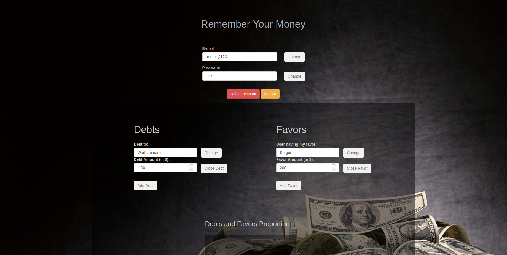
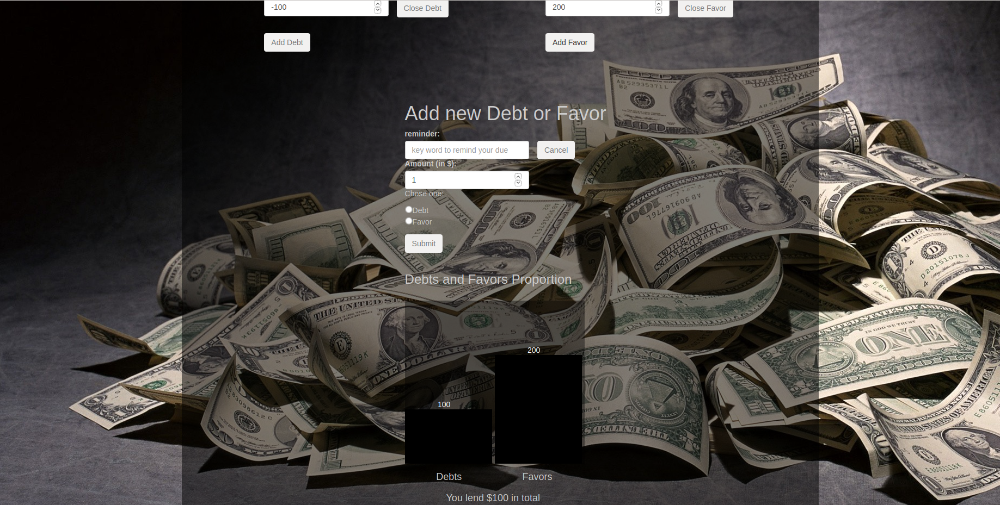

# RYM 
##### (Remember Your Money)

## Description
This project makes part of our academic cours. It is mostly destined to demonstrate the backend management CRUD of the website.

The project is developed with use of: 
	
	- Node.js
	
	- JavaScript
	
	- TypeScript
	
	- ExpressJS
	
	- Bootstrap v3

	- MongoDB

	- Mocha and Chai for testing 

	- Docker 

Made by Artemii Lazovskii and Paul-Louis Rossignol

# Requirements

You need this list of utilities to be installed on your computer in order to run this project:

`npm` v6.13.1

`docker` v19.03.5

`git`

# Installation 

Clone or download https://github.com/PaullouisRossignol/ProjetBackWeb

Go into the folder containing the project and run `npm install`

# Running the project

## Launching

Run `npm run startDB` in order to launch the MongoDB database under the docker.

Run `npm start` and go to the `localhost:8080` in your web browser.

That's it, now you are able to test out the project.

## How to use RYM
RYM is a little service which aims to help you remembering your debts & favors.
When you are at the home page, you can either create a new account or connect to those default accounts:
 - `pl@123` or `artemi@123` to log in with password `123`.
 
  
 Login Page  

You can now access your user page.
There, you can modify your account, using each 'Change' button to update each Line field.
Carefull with the red button: it shows a confirm box to delete your account ! (and all your metrics stored by the way).
The yellow button logs you out.

You're metrics are displayed underneath. You can update them, using the button 'Change'.
The 'close Debt/Favor' button show a confirm box to confirm you want to delete the metric.
  User page top  

Button 'Add Debt/Favor' display a new window at the botton. You can use button 'Cancel' to remove this window. 
At the bottom of the page, A little summary of your account is displayed throught a bar chart and a number representing the addition of all your metrics.
  User page bottom    
>**Note #1:** Either if some problem occured or you successfully update your metrics/account: Little success/error messages should appear on the page. If no message is displayed, it means that nothing have changed!

>**Note #2:** The way we handle favors & debts could sound a little bit strange: If you create/update the amount of a **debt** and make it **positive**, it will be displayed as a **favor** ! (and vice versa) 
So when you update a metric, don't be surprised if it change its type ! (you probably forget the sign)

## Accessing the container

If you want, you can enter in the container where mongo is contained to manage yourself the database. Just use `npm run mongoShell` to access to the container shell.

## Testing

Run `npm test` to execute the testing part

## Stopping 
Use `ctrl+c` shortcut to stop the server (if it is still running in your shell).Then, run `npm run stopDb` to stop the docker container.

## Delete & reinitialise the database
To delete all the mongoDB files and directories, you can use command `npm run rmDb` after stopping the docker container.
To reinitialse the database, docker container must be up. Use command `npm run reinitDb` and you'll have a fresh new container replacing the old one. 
(Your password authorisation will be requiered as mongo files are protected and need administrator permissions to be deleted)

# Routing
|Route|Description|Parameters|
|-----|-----------|----------|
|*GET*: `/`|Welcome Page||
|*GET*: `/userPage`|User Page|`user_id`|
|*POST*: `/getUserMetrics`|Returns the metrics of a concrete user|`user_id/Token`|
|*POST*: `/connectUser`|Connects user from the database|`email/password`|
|*POST*: `/addUser`|Adds User into the database|`email/password`|
|*POST*: `/addMetric`|Adds metric to the database|`user_id/reminder/amount/Token`|
|*POST*: `/delUser`|Deletes user and its metrics from the database|`user_id/Token`|
|*POST*: `/delMetric`|Deletes a concrete metric from the database|`metric_id/Token/user_id`|
|*POST*: `/upUser`|Updates user info|`user_id/email/password/Token`|
|*POST*: `/upMetric`|Updates a concrete metric|`metric_id/amount/reminder/Token`|

